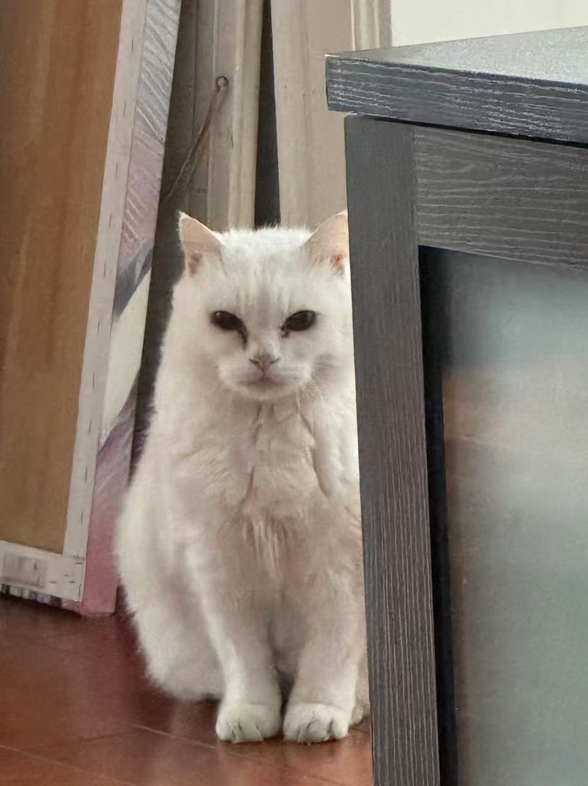

<h1>Hi! This is Yijing Sun</h1>

I am an MPH candidate in Health Policy and Management at Rollins School of Public Health, Emory University. I am interested in public health, data science, statistical analysis and policy research. 

My work focuses on using data to better understand health-related issues, including mental health, alcohol use, aging populations, and healthcare policy. I have experience working with R, SQL, Python, SAS, data visualization, and interactive dashboard development.

<a class="button" href="projects.html">View My Projects</a>

My cat Dudu

My cat Nini

